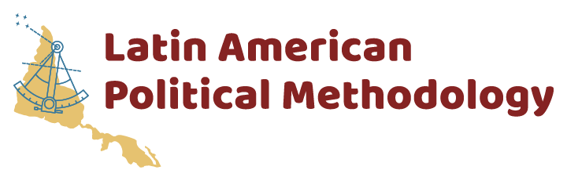
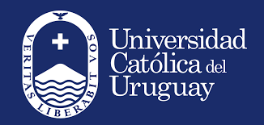
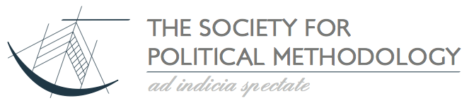

<a href="#apply">Apply</a> | <a href="#logistics">Logistics</a>
---
 

# Latin American Political Methodology Meeting

Welcome! We are excited to announce the third Latin American PolMeth meeting. The event will take place in November 22 and 23 of 2019 in Montevideo, Uruguay. It is hosted by the Universidad Católica del Uruguay, with support from Princeton University, the Society for Political Methodology and the University of North Carolina at Chapel Hill. 

The meeting will feature paper workshops, a poster session for graduate students, and keynote talks by prominent political methodologists.

## Apply
Applications are now open to participate as an *author* or as a presenter of a *graduate student poster*. We encourage those interested in participating to submit their abstracts through our application form, available at the event's [Cambridge University Press website](https://www.cambridge.org/core/membership/spm/register). **The deadline for submission is June 3, 2019. We will inform all applicants of a decision by June 10, 2019.**  

## Register

Registration for this event is not yet open. 

## Program

The event's program is will be defined after the application process is finalized. 

## Logistics

### Meeting location
The meeting will take place in **Montevideo, Uruguay**, at the Universidad Católica del Uruguyay, on **November 22 and 23, 2010**. Additional information will be made available here as the time of the event draws near. 

### Event format
There will be a day of public presentations which will be open to the public, and which feature two keynote talks and a poster session for graduate students. There will also be a day of paper workshops, which will be restricted to registered participants. During this day, previously circulated manuscipts will be actively discussed, and **no presentation will take place**. There will be a short social event for all registered participants on November 22. 

All talks and sessions will be held in English.

### Organizing team

- Santiago López Cariboni (Universidad Católica del Uruguay)
- Carmen Le Foulon (Universidad Católica de Chile)
- Felipe Botero (Universidad de los Andes, Colombia)
- John Londregan (Princeton University)
- Carmen Le Foulon (Universidad Católica de Chile)
- Santiago Olivella (University of North Carolina at Chapel Hill, USA)

### Sponsors

   

